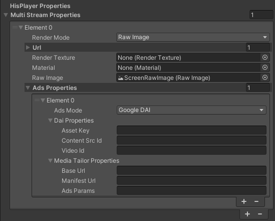

# Playing Ads

Supported advertisement systems : 
- Server-side advertisements
  - Google DAI
  - Media Tailor

## Ads Properties
Use Ads Properties to set all configuration needed to play advertisements for each stream. This property is part of [**Multi Stream Properties**](./setup-guide.md#multi-stream-properties). 
- Ads Mode : Select the types of the advertisement library.
  - None
  - Google DAI
  - Media Tailor
- DAI Properties :
  - Asset Key : For LIVE streams. This is used to determine which stream should be played
  - Content Src Id : For VoD (on-demand) streams. Unique identifier for the publisher content, from a CMS
  - Video Id : For VoD (on-demand) streams. Identifier for the video content source
- Media Tailor Properties :
  - Base Url : Base URL for Video and Ads
  - Manifest Url : Video URL to be attached to the baseURL
  - Ads Params : Contains “Params: string” this is the Ad URL to be attached to the baseURL

<p align="center">

</p>

## Server-Side Advertisement Systems
### Google DAI
Google DAI is a Server-Side Ad-Insertion solution offered by Google where HISPlayer is pre-integrated and offers playback for HLS and DASH Streams.

To use Google DAI:
- It is needed to include the Google DAI SDK
- It is needed to set Ads Properties > AdsMode : **Google DAI**

#### Include the DAI SDK
Google DAI has a dependency on the DAI SDK. Hence, this library needs to be included in your page, otherwise the playback will start without ads. The following snippets demonstrates how this SDK can be included in your html or javascript file :
```
<script type="text/javascript" src="https://imasdk.googleapis.com/js/sdkloader/ima3_dai.js"></script>
```

#### Configure the Ads Properties
For Live :
- Ads Mode : Google DAI
- DAI Properties :
  - Asset Key : <YOUR_ASSET_KEY>

<p align="center">

</p>

For VoD : 
- Ads Mode : Google DAI
- DAI Properties :
  - Content Src Id : <YOUR_CONTENT_SRC_ID>
  - Video Id : <YOUR_VIDEO_ID>

<p align="center">

</p>

### MediaTailor
MediaTailor is a service that provides scalable ad insertion and channel assembly. It is able to serve targeted ad content to viewers and create linear streams while maintaining broadcast quality in over-the-top (OTT) video applications. It supports HLS and DASH for both VOD and live workflows.

To use MediaTailor:
- It is needed to set Ads Properties > AdsMode : **Media Tailor**

#### Configure the Ads Properties
- Ads Mode : Media Tailor
- Media Tailor Properties :
  - Base Url : <YOUR_BASE_URL>
  - Manifest Url : <YOUR_MANIFEST_PATH>

<p align="center">

</p>


