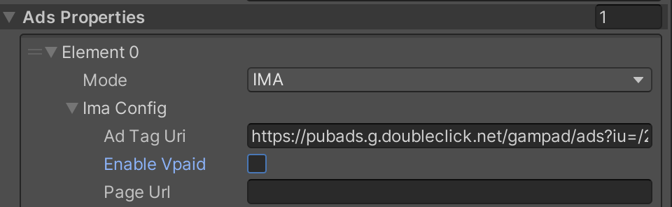
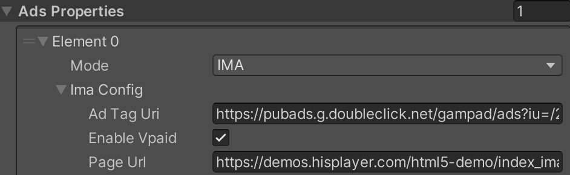

# Playing Ads

Supported advertisement systems:
- Client-side advertisements:
  - Google IMA

- Server-side advertisements
  - Google DAI
  - AWS Media Tailor

## Ads Properties
Use Ads Properties to set all configuration needed to play advertisements for each stream. This property is part of [**Multi Stream Properties**](./setup-guide.md#multi-stream-properties).
- Ads Mode : Select the types of the advertisement library.
  - DAI
  - MEDIA_TAILOR
  - IMA
  - NONE
- IMA Config:
  - Ad Tag Uri: Advertisement URL that is going to be played. VAST, VPAID, VMAP are supported. If IMA is ad mode is used this parameter is mandatory.
  - Enable Vpaid: Enables the usage of VPAID. The ads mode must be IMA.
  - Page Url: Adds a parameter to the ad request to keep track of the domain that sent the request. For targeting purposes. The ad mode must be IMA.
- DAI Config :
  - Asset Key : For LIVE streams. This is used to determine which stream should be played
  - Content Src Id : For VoD (on-demand) streams. Unique identifier for the publisher content, from a CMS
  - Video Id : For VoD (on-demand) streams. Identifier for the video content source
- Media Tailor Config :
  - Base Url : Base URL for Video and Ads
  - Manifest Url : Video URL to be attached to the baseURL
  - Ads Params : Contains “Params: string” this is the Ad URL to be attached to the baseURL

## Client-Side Advertisement
### Google IMA
Google IMA SDK is a client-side ad insertion solution offered by Google pre-integrated with HISPlayer that allows to integrate multimedia ads into your websites and apps.

To use Google IMA:
- It is needed to include the Google IMA SDK
- It is needed to set Ads Properties > AdsMode : **IMA**

#### Include the IMA SDK
Google IMA has a dependency on the IMA SDK. Hence, this library needs to be included in your page, otherwise the playback will start without ads. The following snippets demonstrates how this SDK can be included in your html or javascript file :
```
<script type="text/javascript" src="https://imasdk.googleapis.com/js/sdkloader/ima3.js"></script>
```

#### Configure the Ads Properties
- Ads Mode: IMA
- Ad Tag Uri : "YOUR_AD_URI"



- Enable Vpaid: optional (true or false).


- Page Url: "YOUR_PAGE_URL" (e.g. **https://demos.hisplayer.com/html5-demo/index_ima.html**)



## Server-Side Advertisement Systems
### Google DAI
Google DAI is a server-side ad insertion solution offered by Google pre-integrated with HISPlayer and offers playback for HLS and DASH Streams.

To use Google DAI:
- It is needed to include the Google DAI SDK
- It is needed to set Ads Properties > AdsMode : **DAI**

#### Include the DAI SDK
Google DAI has a dependency on the DAI SDK. Hence, this library needs to be included in your page, otherwise the playback will start without ads. The following snippets demonstrates how this SDK can be included in your html or javascript file :
```
<script type="text/javascript" src="https://imasdk.googleapis.com/js/sdkloader/ima3_dai.js"></script>
```

#### Configure the Ads Properties
For Live :
- Ads Mode : DAI
- DAI Config :
  - Asset Key : "YOUR_ASSET_KEY" (e.g. **PSzZMzAkSXCmlJOWDmRj8Q**)


For VoD :
- Ads Mode : DAI
- DAI Config :
  - Content Src Id : "YOUR_CONTENT_SRC_ID" (e.g. **2542753**)
  - Video Id : "YOUR_VIDEO_ID" (e.g. **WNET0056239080000200**)


### MediaTailor
MediaTailor is a service that provides scalable ad insertion and channel assembly. It is able to serve targeted ad content to viewers and create linear streams while maintaining broadcast quality in over-the-top (OTT) video applications. It supports HLS and DASH for both VOD and live workflows.

To use MediaTailor:
- It is needed to set Ads Properties > AdsMode : **Media Tailor**

#### Configure the Ads Properties
- Ads Mode : MEDIA_TAILOR
- Media Tailor Config :
  - Base Url : "YOUR_BASE_URL" (e.g. **https://ad391cc0d55b44c6a86d232548adc225.mediatailor.us-east-1.amazonaws.com**)
  - Manifest Url : "YOUR_MANIFEST_PATH" (e.g. **/v1/session/d02fedbbc5a68596164208dd24e9b48aa60dadc7/singssai/master.m3u8**)


## Related APIs

### Properties

* **public List <AdsProperties> adsProperties**: List of properties to configure advertisement insertions for each player in the scene

* **public class AdsProperties**:
  * **public enum AdsMode**: Types of the advertisement library.
  * **public struct ImaConfig**: Config for IMA ads mode.
  * **public struct DaiConfig**: Config for DAI ads mode.
  * **public struct MediaTailorConfig**: Config for MediaTailor ads mode.

* **public enum AdsMode**: Types of the advertisement library.
    * **DAI**
    * **MEDIA_TAILOR**
    * **IMA**
    * **NONE**

* **public struct ImaConfig**: Config for DAI ads mode.
    * **public string adTagUri**: Client-side ad to be used. AdsMode must be IMA.
    * **public bool enableVpaid**: Enables the usage of VPAID. AdsMode must be IMA.
    * **public bool pageUrl**: Adds a parameter to the ad request to keep track of the domain that sent the request. For targeting purposes. AdsMode must be IMA.

* **public struct DaiConfig**: Config for DAI ads mode.
    * **public string assetKey**: For live streams. This is used to determine which stream should be played.
    * **public string contentSrcId**: For VoD (on-demand) streams. Unique identifier for the publisher content, from a CMS.
    * **public string videoId**: For VoD (on-demand) streams. Identifier for the video content source.

* **public struct MediaTailorConfig**: Config for MediaTailor ads mode.
    * **public string baseUrl**: Base URL for video and ads.
    * **public string manifestUrl**: Video URL to be attached to the baseURL.
    * **public string adsParams**: Contains 'Params: string' this is the ad URL to be attached to the baseURL.

### Event and Virtual Functions

* **public enum HisPlayerEvent**: The list of events provided by HISPlayer SDK for playing advertisements. You can use the event using the virtual functions in the next section.
  * **HISPLAYER_EVENT_AD_BLOCK_STARTED**
  * **HISPLAYER_EVENT_AD_BLOCK_ENDY**
  * **HISPLAYER_EVENT_AD_STARTED**
  * **HISPLAYER_EVENT_AD_STOPPED**
  * **HISPLAYER_EVENT_AD_PODS_INFO**

#### protected virtual void EventAdBlockStarted(HisPlayerEventInfo eventInfo)
Override this method to add custom logic when **HisPlayerEvent.HISPLAYER_EVENT_AD_BLOCK_STARTED** is triggered. This event occurs whenever a group of advertisements starts.

#### protected virtual void EventAdBlockEnd(HisPlayerEventInfo eventInfo)
Override this method to add custom logic when **HisPlayerEvent.HISPLAYER_EVENT_AD_BLOCK_END** is triggered. This event occurs whenever a group of advertisements ends.

#### protected virtual void EventAdStarted(HisPlayerEventInfo eventInfo)
Override this method to add custom logic when **HisPlayerEvent.HISPLAYER_EVENT_AD_STARTED** is triggered. This event occurs whenever a single advertisement starts.

#### protected virtual void EventAdStopped(HisPlayerEventInfo eventInfo)
Override this method to add custom logic when **HisPlayerEvent.HISPLAYER_EVENT_AD_STOPPED** is triggered. This event occurs whenever a single advertisement ends.

#### protected virtual void EventAdPodsInfo(HisPlayerEventInfo eventInfo)
Override this method to add custom logic when **HisPlayerEvent.HISPLAYER_EVENT_AD_PODS_INFO** is triggered. This event occurs whenever there is an advertisement pods information indicating cue points of ad breaks.

<table>
  <tr>
    <th>Name</th>
    <th>Description</th>
  </tr>
  <tr>
    <td>param1</td>
    <td>Start cue point of ad break in milliseconds</td>
  </tr>
   <tr>
    <td>param2</td>
    <td>End cue point of ad break in milliseconds</td>
  </tr>
</table>

### Non-virtual Functions

#### protected float GetAdDuration(int playerIndex)
Get the duration of a certain advertisement in milliseconds (ms). The **playerIndex** is associated with the index of the element of **Multi Stream Properties**, e.g. the index 0 is the element 0 in the list.

#### protected float GetAdRemainingTime(int playerIndex)
Get the remaining time of a certain advertisement in milliseconds (ms). The **playerIndex** is associated with the index of the element of **Multi Stream Properties**, e.g. the index 0 is the element 0 in the list.

#### protected float GetAdCurrentTime(int playerIndex)
Get the current time of a certain advertisement in milliseconds (ms). The **playerIndex** is associated with the index of the element of **Multi Stream Properties**, e.g. the index 0 is the element 0 in the list.

#### protected void ChangeVideoContent(int playerIndex, string url, int resumePosition, AdsProperties ads)
Change video content at run time of a certain stream. The **url** is the new content that will be running on the stream. The **resumePosition** is time position in milliseconds (ms) where the new content is starting the playback, default value is 0. The **AdsProperties** is an ads properties to use when loading the new content, default value is null. The **playerIndex** is associated with the index of the element of **Multi Stream Properties**, e.g. the index 0 is the element 0 in the list.

