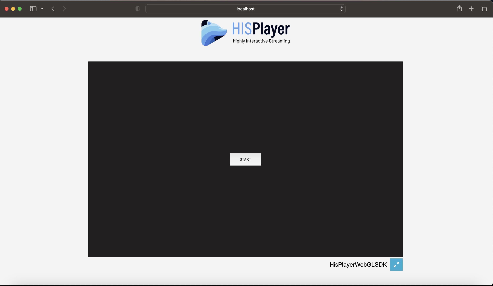

# Safari Playback Limitation

Safari on macOS and iOS devices has restrictions that avoid playing media content with audio. Due to this limitation, the playback is automatically paused every time the content is unmuted.

In order to play unmuted video on Safari it is necessary to start the load of the Unity scene through an interaction and play any sound via an audio element.

The following code is used in "/Assets/WebGLTemplates/HisPlayerTemplate/index.html" of the HISPlayer WebGL sample application and it contains the workaround to solve the limitation:
```js
// Function to load the Unity instance
const loadUnity = function () {
  let script = document.createElement("script");
  script.src = loaderUrl;
  script.onload = () => {
    createUnityInstance(canvas, config, (progress) => {})
    .then((unityInstance) => {
      fullscreenButton.onclick = () => {
        unityInstance.SetFullscreen(1);
      };
    }).catch((message) => {
      alert(message);
    });
  };
  document.body.appendChild(script);
};

if (navigator.userAgent &&
  navigator.userAgent.includes('Safari') &&
  navigator.userAgent.includes('Version')) {

    // Create and style the button for initiating Unity
    const startButton = document.createElement('button');
    startButton.innerHTML = 'START';
    startButton.style.width = '10%';
    startButton.style.height = '6.5%';
    startButton.style.margin = 0;
    startButton.style.position = 'absolute';
    startButton.style.top = '50%';
    startButton.style.left = '50%';
    startButton.style.transform = 'translate(-50%, -50%)';
    const unityContainer = document.getElementById('unity-container');
    unityContainer.appendChild(startButton);
    startButton.onclick = evt => {
      // Workaround for Safari iOS and macOS
      const audioElem = document.createElement('audio');
      audioElem.setAttribute('playsinline', '');
      audioElem.src = 'TemplateData/1-second-of-silence.mp3';
      audioElem.play();
      startButton.parentElement.removeChild(startButton);
      loadUnity();
    };
  } else {
    loadUnity();
  }
``````

The following image is the HISPlayer sample using a HTML button to trigger a user interaction. Please, take into account that you can modify the styling of this button or any other element as you desire.


<p align="center">

</p>