# QuickStart Guide
Getting started with HISPlayer consists of implementing the following steps:

1. Import and configure package   

      1.1. Import package
 
      1.2. Configure Unity for WebGL
   
2. Create your own sample
   
    2.1 Setup HISPlayer Manager
   
    2.2 Attach Unity Resources
   
    2.3 Configure HISPlayer Properties

    2.4 Build and Run

It's also possible to import the [HISPlayer Sample](/import-sample.md) after completing step 1. The sample is a comprehensive example scene using the HISPlayerSDK to help demonstrate features like play, pause, seek, etc.

## 1.1 Import package
Importing the package is the same as importing other normal packages in Unity. Select the package of HISPlayer SDK and import it.
<br>
**Assets > Import Package > Custom Package > HISPlayerWebGLSDK unity package**

<p align="center">
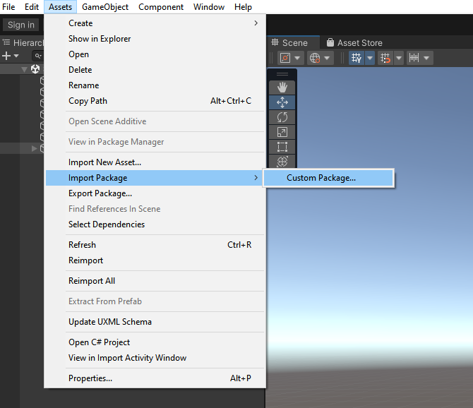
</p>

<br>

## 1.2 Configure Unity for WebGL
Once the package is imported, please follow below steps.
First of all switch the platform for **WebGL**. Open **File > Build Settings** and then select **WebGL platform** and **switch platform**.

<p align="center">
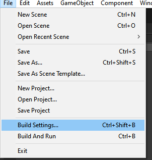
&nbsp; &nbsp; &nbsp; &nbsp;  
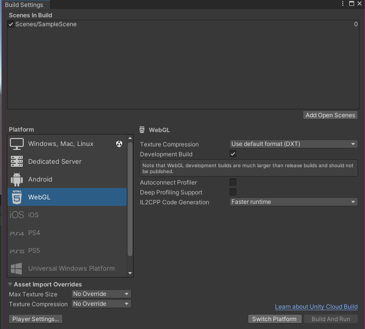 
</p>

Inside the previous image in the right there is a button in the bottom left corner to open **Player Settings**. Now inside Player configuration, select **WebGL > Other Settings**. The Color Space can be Gamma or Linear. In the second case, it is needed to disable the **Auto Graphics API** option. 

<p align="center">
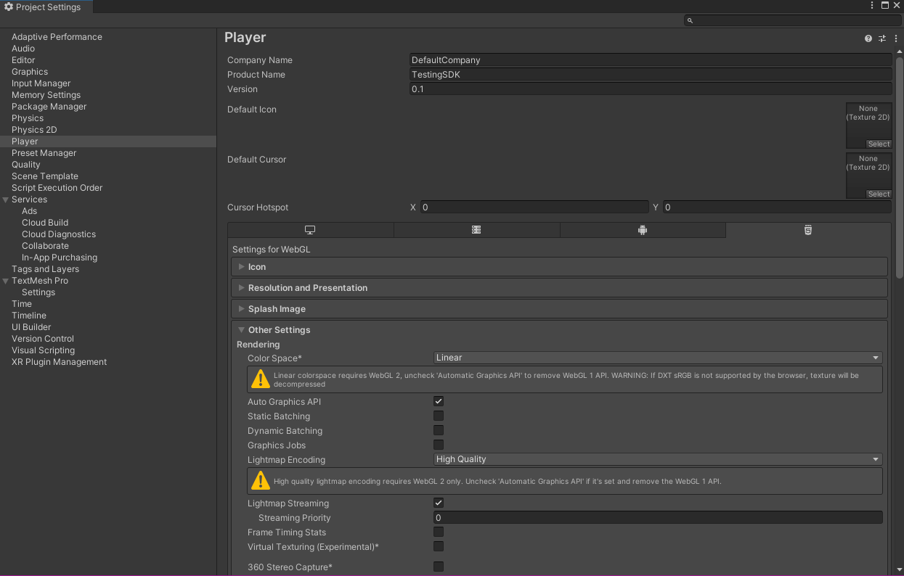
&nbsp; &nbsp; &nbsp; &nbsp;  
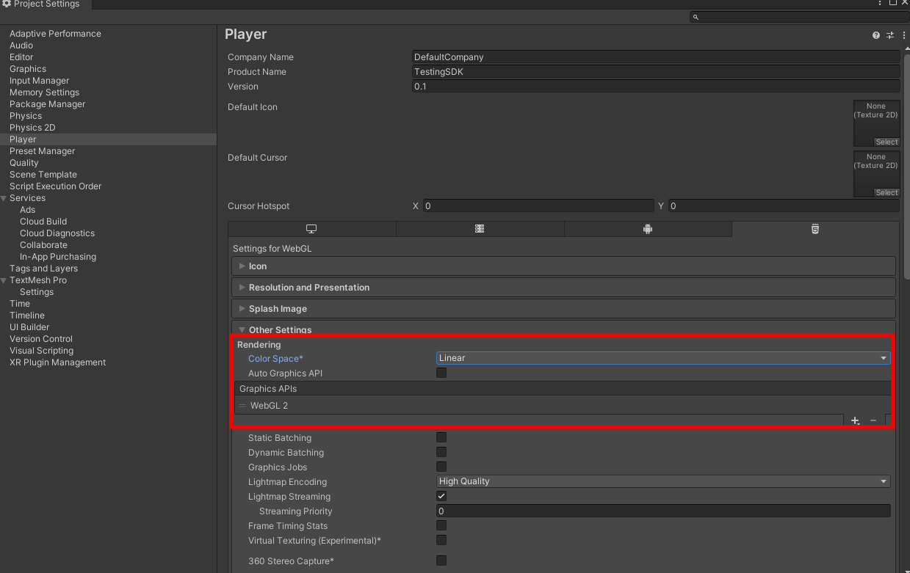 
</p>

Copy the **WebGLTemplates** folder from the **HISPlayer** package folder into the **Unity Assets** folder.
<p align="center">
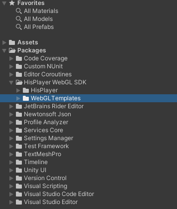
&nbsp; &nbsp; &nbsp; &nbsp;  
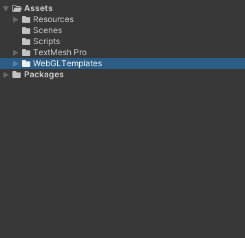 
</p>

Select the **HisPlayerTemplate** inside the **Resolution and Presentation** section.
<p align="center">
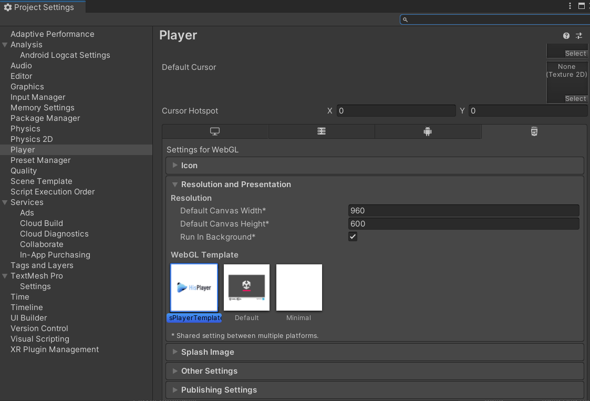
</p>

## 2.1 Setup HISPlayer Manager
Create a new script which will inherit from HISPlayerManager, for example, **WebGLStreamController** . It is necessary to add the ‘using HISPlayerAPI;’ dependancy. Then, add this component to a new game object (recommended to be empty).

Call the SetUpPlayer() function in order to initialize the stream environment internally. This function can be called whenever it’s needed. For example, using the Awake function:

For example, using the Awake function:

```C#
using System.Collections;
using System.Collections.Generic;
using UnityEngine;
using HisPlayerAPI;

public class WebGLStreamController : HisPlayerManager
{
    protected override void Awake()
    {
        base.Awake();
        SetUpPlayer();
    }
}
```

It is strictly necessary to use SetUpPlayer before using anything else. This function initializes everything else that will be needed during the usage of HISPlayer APIs. 

Remember to call the Release function after closing the app or before changing scenes in Unity for freeing the internal resources. 

## 2.2 Attach Unity resources

Move to **Unity Editor** to attach all the resources. The rendering system is supporting **Material**, **RawImage** and **RenderTexture** Unity’s components.

### <ins>Material</ins>
Create a new Material from **Assets > Create > Material** and attach it to the GameObject that is going to be used as screen and to the stream controller component. 

You can also use the **Resources > Materials > HISPlayerDefaultMaterial.mat** we provide in our package. 

<p align="center">


</p>

### <ins>Raw Image</ins>
This action will be related to Unity’s Canvas. If there is not a Canvas created yet, creating a **Raw Image** will create one automatically.

For the creation, select **GameObject > UI > Raw Image**. Once it is created, attach it to the stream controller component

<p align="center">

</p>

### <ins>RenderTexture</ins>
For this you can use the RenderTexture we provide or create a RenderTexture from zero. In the first case, go to the Resources folder of our package and attach the **Resources > Materials > HISPlayerDefaultMaterialRenderTexture.mat** to the GameObject that is going to be used as screen and the **Resources > RenderTextures > HISPlayerRenderTexture.renderTexture** to the stream controller component.

For creating it from zero, select **Assets > Create > Render Texutre** and then create a **Material** referencing the **Render Texture**. This last action can be done automatically by grabbing the **Render Texture** and dropping it at the end of a GameObject's Inspector with the component **Mesh Renderer** with **Material field empty**. This will create the new material inside a **Materials** folder. 

Once all this process it’s done, associate the **RenderTexture** to the script component.

<p align="center">

</p>


## 2.3 Configure HISPlayer Properties

### Multi Stream Properties
HISPlayer WebGL SDK supports multi streams to run multiple players with different configurations and contents (not supported on Windows Editor). Use **Multi Stream Properties** to set all configuration needed for multi stream. It starts with 0 elements. Each element added has its own configuration for multiple players and corresponds to 1 Render Surface.
* **Render Mode**: Select the render surface. It can be **RenderTexture, Material** or **RawImage**.
* **URL**: Add the **URL** associated to the Render Material. Each URL corresponds to 1 player. Each element can have multiple URLs, therefore users can use the same Render Surface to use multiple players and play different URLs.
* **Material**: Attach the **Material** asset created to the **Material** section of the element.
* **Raw Image**: Attach the **RawImage** asset created to the **RawImage** section of the element.
* **Render Texture**: Attach the **RenderTexture** to the **RenderTexture** section of the element.
<p align="center">
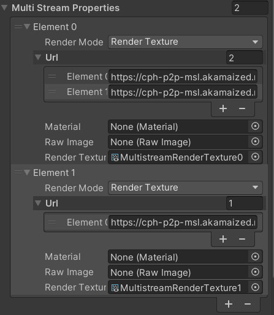
</p>
If you just need a single stream, then you just need to add 1 element with 1 URL.

### Auto Play
Property to determine whether all the players will start automatically after set up. This property is shared for all players. Keep in mind that even if the Autoplay is enabled, the videos will have no sound from the beginning due to the browsers autoplay policy.

### Loop Play
Property to determine whether all the players will play the same content again automatically after reaching the end of the content. This property is shared for all players.

### Disable ABR
Property to determine whether all the players will disable ABR after set up. This property is shared for all players. This property is set to false by default. 
Disabling ABR by setting this API to true might improve performance, especially for multi stream usage which will set all streams to the lowest resolution in the beginning.
If you want to enable or disable the ABR of each player or stream, please refer to the DisableABR and EnableABR API in **HisPlayer API** section.

### License Key
Input the license key that is associated with the SDK. If there is no license key inputted, the default license key will be used. If the license key is not valid, the player will not work and throw an error message.
<p align="center">
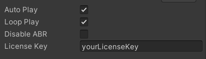
</p>

## 2.4 Build and Run
Now the configuration it’s done, so it’s time to **Build And Run**. Open **Build Settings** and test it.
<p align="center">
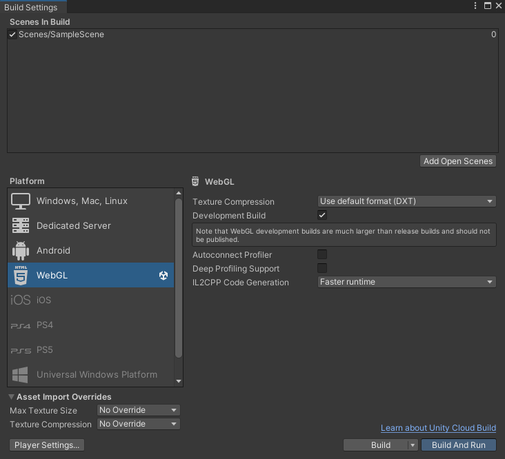
</p>
