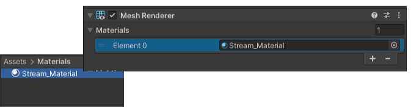
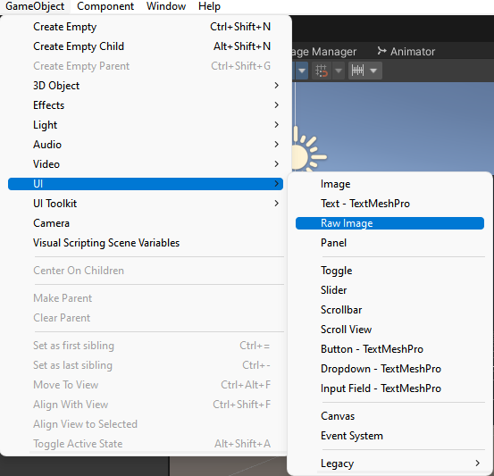
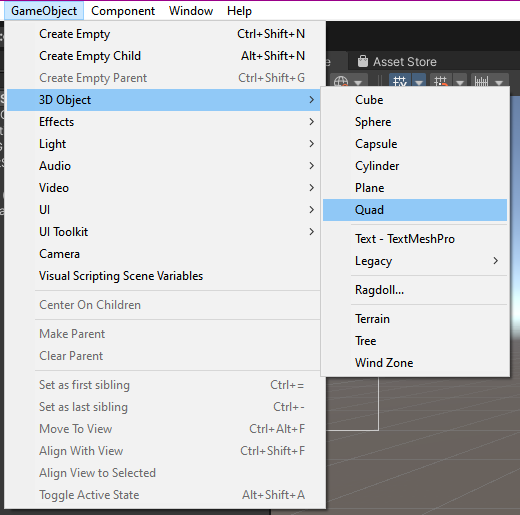
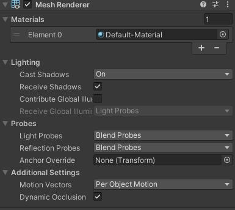
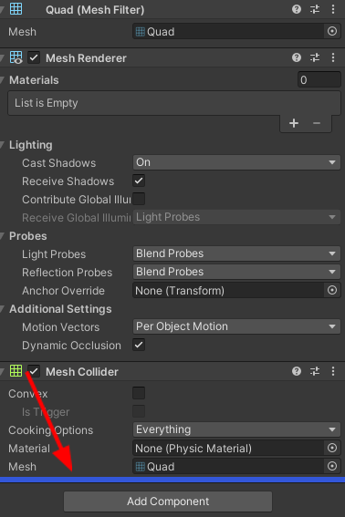
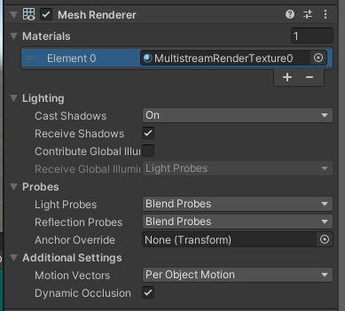

# Setup Guide
Through this guide, you will be introduced to the basic steps for setting up the playback.

## Import package
Importing the package is the same as importing other normal packages in Unity. Select the package of HISPlayer SDK and import it.
<br>
**Assets > Import Package > Custom Package**

<p align="center">

</p>

<br>

## Configure Unity for WebGL
Once the package is imported, it is time to do some configuration inside Unity.
First of all switch the platform for **WebGL**. Open **File > Build Settings** and then select **WebGL platform** and **switch platform**.

<p align="center">

&nbsp; &nbsp; &nbsp; &nbsp;  
 
</p>

Inside the previous image in the right there is a button in the bottom left corner to open **Player Settings**. Now inside Player configuration, select **WebGL > Other Settings**. The Color Space can be Gamma or Linear. In the second case, it is needed to disable the **Auto Graphics API** option. 

<p align="center">

&nbsp; &nbsp; &nbsp; &nbsp;  
 
</p>

Select the **HisPlayerTemplate** inside the **Resolution and Presentation** section.
<p align="center">

</p>

If this option doesn’t appear, then copy the **WebGLTemplates** folder from the **HISPlayer** package folder into the **Unity Assets** folder.
<p align="center">

&nbsp; &nbsp; &nbsp; &nbsp;  
 
</p>

## Setup HISPlayer Manager
Create a script (for example **WebGLStreamController**) which is going to inherit from **HisPlayerManager**. It is needed to include the namespace by adding **‘using HisPlayerAPI;’** and add this component to a GameObject. It is recommended to create an **Empty GameObject** for this.
<br>
Now it’s time to call the **‘SetUpPlayer()’** function in order to initialize the stream environment internally. This function can be called whenever it’s needed, so it could be from the beginning of with an input.
<br>
For example, using the Awake function:
```C#
using System.Collections;
using System.Collections.Generic;
using UnityEngine;
using HisPlayerAPI;

public class WebGLStreamController : HisPlayerManager
{
    protected override void Awake()
    {
        base.Awake();
        SetUpPlayer();
    }
}
```
It is strictly necessary to use **SetUpPlayer** before using anything else, because this function will initialize everything from the SDK in order to be able to use the rest of the functions (Play, Pause, Seek…).

## Attach Unity Resources
Let’s move to **Unity Editor** to attach all the resources. The rendering system supports **Material, RawImage** and **RenderTexture** Unity’s components.

### Attach Material
Move into Assets’ folder for creating a new **Material**. It is possible to create a new **Material** into **Assets > Create > Material**.
<p align="center">

</p>
Attach the material to the GameObject which is going to be used as a screen.
<p align="center">

</p>

### Attach RawImage
This action will be related to Unity’s Canvas. If there is not a Canvas created yet, creating a **Raw Image** will create one automatically. 
For the creation select, select **GameObject > UI > Raw Image**
<p align="center">

</p>
Once it is created, it can be associated with the stream controller script without doing anything else (Refer to **Configure HisPlayer Properties**).

### Attach RenderTexture
First of all, check if the **Resources** folder exists and contains the **RenderTextures** folder. If it doesn’t exist then do the same process as we did before with the WebGLTemplates. In this case, look for the Resources folder and copy its contents into the Unity **Assets** folder. This folder contains **Unity RenderTexture** resources. Another option is creating **RenderTexture** in **Assets** directly.

<br>

The **RenderTexture** has to be attached to the GameObject which will be a screen for rendering the multimedia stream.

<br>

For creating this object, select **GameObject > 3D Object > Quad**. Then select the GameObject and remove the material attached to its **Mesh Renderer** component, then replace it with the **RenderTexture** created. The **RenderTextures** folder provided by the SDK contains the **Material** folder and this material is the one which is needed to be used for the replacement . If the **RenderTexture** resource has been created from 0, then another option is to grab the **RenderTexture** from the **Assets** folder and drop it at the end of the GameObject’s Inspector, this will create a new material automatically.

<p align="center">

&nbsp; &nbsp; &nbsp; &nbsp;  
 
</p>
<br>
<p align="center">

&nbsp; &nbsp; &nbsp; &nbsp;  
 
</p>
Once all this process it’s done, it’s time to associate the **RenderTexture** to the script component.

