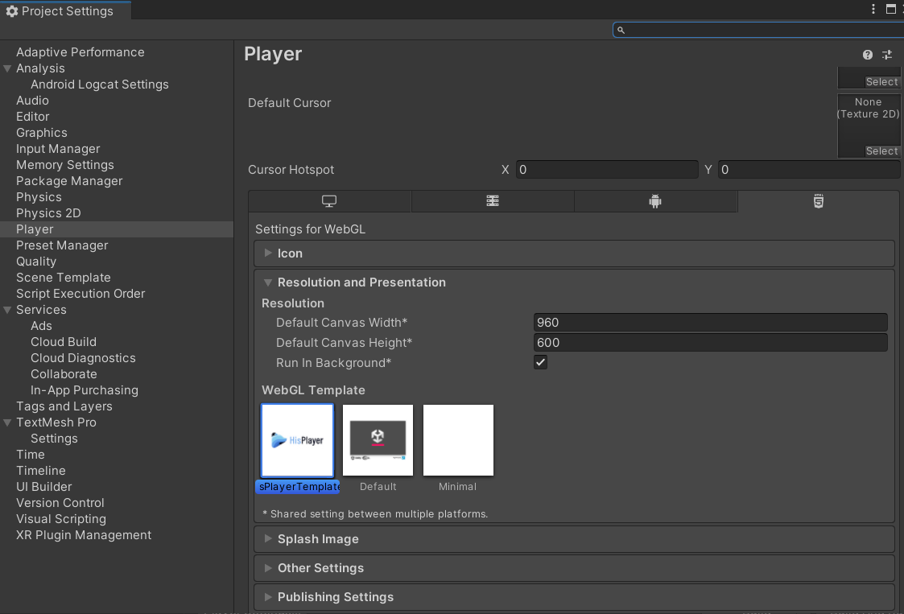

# Update the SDK

Through this guide, you will be introduced how to update the SDK if you already have installed the SDK previously.

## Remove Old Package

Remove the previous HISPlayer WebGL SDK package from Unity Package Manager

**Window > Package Manager > Packages - HISPlayer > HISPlayer WebGL SDK > Remove**

 

## Import New package

Importing the new package is the same as importing other normal packages in Unity. 
Select the package of HISPlayer SDK and import it.

**Assets > Import Package > Custom Package > HISPlayerWebGLSDK unity package**

 

## Configure Unity for WebGL
Once the package is imported, please follow below steps.

Copy the **WebGLTemplates** folder from the **HISPlayer** package folder into the **Unity Assets** folder. This should replace the old template.

&nbsp; &nbsp; &nbsp; &nbsp;  
 

Select the **HisPlayerTemplate** inside the **Player Settings** > **Resolution and Presentation** section.

## Update License Key
Input the license key that is associated with the SDK through HISPlayer properties. If the license key is not valid, the player won't work and will throw an error message.

